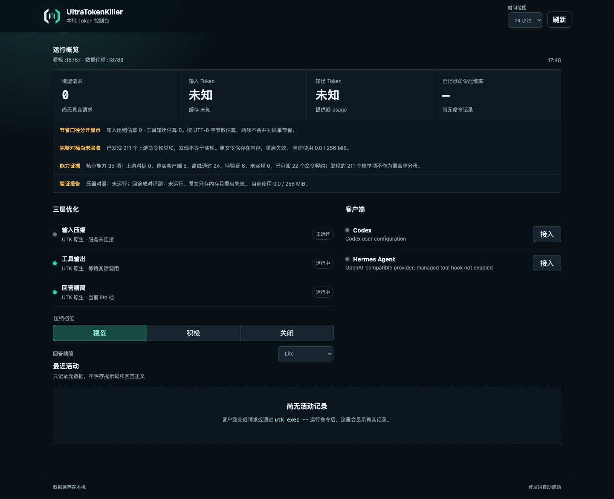
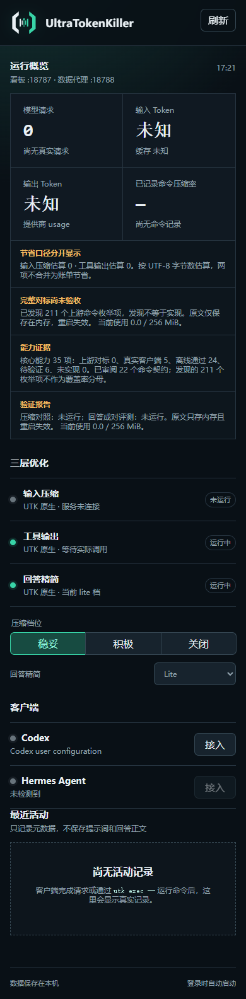
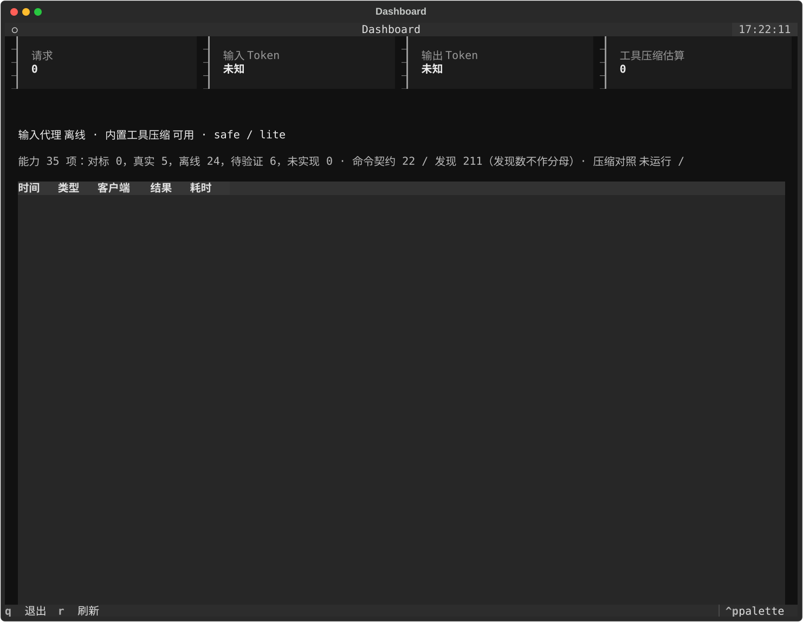
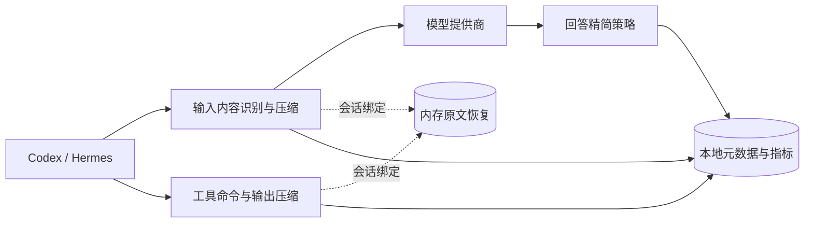

<picture>
  <source media="(prefers-color-scheme: dark)" srcset="web/public/brand/utk-lockup.svg">
  
</picture>

# UltraTokenKiller

UTK 是本地原生 Token 优化工具。输入压缩、工具输出压缩、回答精简由 UTK 自己实现，不安装或调用 Headroom、RTK、Caveman。普通 Python/Web 框架依赖仍由安装器安装。

## 产品预览



<details>
<summary>查看窄屏网页和终端看板</summary>





</details>

桌面截图来自 2026-09-20 的 macOS arm64 实机打包服务，窄屏截图来自同一提交的 Windows 隔离实例，分别使用 1440×1100 和 390×844 视口。数据均为隔离 `UTK_HOME` 的真实空状态，不含提示词、回答、凭据或用户指标。能力数字表示当前清单状态，不表示完整对标已经完成。



输入与工具压缩估算分别展示，不相加为账单节省。原文只存守护进程内存，过期或重启后不可恢复。

## 当前原生能力

当前是开发预览版，尚未达到固定版本三层核心能力完整对标标准。

- 输入：JSON 异常值及少数状态保留、日志聚合、多语言代码摘要、补丁、搜索结果、中英文长文本和内联图像压缩；本地语义模型需单独安装。图像只在确认是大型照片且压缩至少减少 15% 时缩放，文字密集、细节任务、用途不明或能力未就绪时保守透传。
- 恢复与缓存：原文仅在守护进程内存保存；MCP `utk_retrieve` 按会话找回。已压缩和已透传历史保持稳定；容量不足时停止新增有损压缩。
- 工具：`utk exec` 提供部分 Git、搜索、测试及诊断输出规则。支持暂存差异、Git 工作目录参数和 `python -m pytest`；提交日志保留正文。未知输出透传，保留退出码，取消时清理自有进程树。
- 统计：会话内工具指标通过认证的本地接口由守护进程统一写入 SQLite，避免沙箱内共享数据库失败。相同执行标识去重；不保存命令参数、提示词、回答正文或凭据。
- 回答：lite/full/ultra/off 与文言档位；结构化输出和详细解释要求优先。不截断已生成内容，不声称未经对照的节省比例。
- 协议：Responses、Chat Completions、Anthropic Messages 的 HTTP/SSE 转发；WebSocket 透传有离线测试，但未完成真实客户端验收。
- 看板：终端与网页读取统一统计。网页显示原文内存状态、已观测命令的压缩比例与未完成对标提示。
- 证据：能力与命令契约绑定实现、测试和固定基线的源码指纹；代码变化会自动将旧状态降级，避免把“文件存在”当作验证通过。

**已验证：**Windows 与 WSL Ubuntu 离线回归；Windows Codex 0.138.0 使用现有订阅和 `gpt-5.6-luna` 完成输入压缩、`utk exec` 压缩及 MCP 原文找回任务。验收使用隔离端口和临时配置覆盖，没有替换本机现用代理。

真实模型账单用量未返回，仍显示未知。Hermes CLI／gateway 的受管 shell hook 已实现离线验证：只改写可证明安全的终端命令，只授权 `utk hermes-hook`，禁用时保留用户钩子与授权；真实 Hermes 客户端任务仍未验收。全部 RTK 命令、上游效果对照和三平台干净安装也尚未完整验收。详见 [兼容矩阵](COMPATIBILITY.md) 和 [Luna 验收记录](docs/acceptance-luna-2026-09-19.md)。

## 安装

Codex 自动会话开发预览入口为 `utk codex --model gpt-5.6-luna`。它只对新启动的进程绑定代理、只读命令钩子和原文查询，不改全局接入设置；修复后的真实编码验收仍待完成。版本限制与最新证据见 [自动会话进度](docs/codex-auto-session-2026-09-19.md)。

Python 3.10+，推荐 3.11。从源码目录执行：

Windows：

```powershell
powershell -ExecutionPolicy Bypass -File .\scripts\install.ps1
```

macOS / Linux：

```sh
sh ./scripts/install.sh
```

开发安装：

```sh
python -m pip install -e ".[test]"
utk install
utk doctor
utk capabilities
utk capabilities --json
utk benchmark
# 只有显式提供经过校验的固定上游结果时，才会生成上游对照结论
utk benchmark --reference path/to/reference-results.json --model gpt-5.6-luna
# 一次生成透传、旧版、固定上游和当前 UTK 四路对齐报告
utk benchmark --mode matrix --reference path/to/reference-results.json --model gpt-5.6-luna
utk web
```

维护者可在三个隔离 checkout 均处于锁定提交时生成输入层上游结果包：

```sh
python scripts/generate-reference.py --headroom path/to/headroom --rtk path/to/rtk --caveman path/to/caveman --output reference-results.json
```

结果包会分别记录三层覆盖数；当前固定样例是输入压缩套件，因此 RTK 与 Caveman 覆盖明确为 0，不会把“提交已校验”冒充三层对标通过。Headroom 缺少固定提交编译扩展时生成会失败并说明原因。首份实测结果与剩余差距见 [固定上游输入层对照](docs/upstream-input-reference-2026-09-20.md)。

维护者也可以让固定 RTK 二进制读取捕获的公开失败输出，以验证命令专属过滤器，而不重新执行测试或写操作：

```sh
python scripts/generate-rtk-reference.py --checkout path/to/rtk --binary path/to/rtk-binary --output rtk-reference.json --comparison rtk-comparison.json
```

当前 8 个捕获输出样例均保留关键事实，UTK 压缩率达到对应固定 RTK 的 95.5% 至 157.1%。这只是已验证命令族证据，不代表已覆盖全部 RTK 清单，详见 [固定 RTK 捕获输出对照](docs/upstream-rtk-reference-2026-09-20.md)。

能力状态的源码绑定和自动降级规则见 [能力证据绑定](docs/capability-evidence-2026-09-20.md)。当前 32/36 个核心能力及 22/22 个已审阅命令契约通过离线套件并绑定当前源码；211 个固定 RTK 命令变体已全部纳入覆盖分母；55 项已映射现有审阅契约，156 项仍待逐项验证。分母来源、命令族统计和剩余证据要求见 [RTK 命令覆盖分母](docs/rtk-command-denominator-2026-09-20.md)。剩余 4 项是 Caveman 成对质量、固定上游四路对照及 Hermes CLI/gateway 真实验收，不能以透传或测试文件存在冒充通过。

Caveman 固定策略契约可离线复现，不调用模型：

```sh
python scripts/generate-caveman-reference.py --checkout path/to/caveman --output caveman-policy-reference.json
```

当前 6 个启用档位、`off` 无操作行为和 7 组共同安全规则均通过固定源文件核对。该结果只证明指令策略覆盖，不冒充回答质量或输出节省比例，详见 [固定 Caveman 策略契约](docs/upstream-caveman-policy-reference-2026-09-20.md)。

隔离验证时设置 `UTK_HOME`，执行 `utk install --no-clients --no-autostart`。看板优先使用 127.0.0.1:18787，端口占用时选择空闲端口。无需另外下载压缩器；`--skip-downloads` 仅作为旧命令兼容参数。

已有本地 Headroom 等代理不会自动串联。客户端上游仍指向本地代理时，安装器保留配置并提示先恢复原始上游。旧版本配置中的 headroom/rtk/caveman 字段名暂保留为迁移兼容别名，不表示运行这些外部程序。

## 管理

`install`、`doctor`、`status`、`start`、`stop`、`enable`、`disable`、`profile`、`exec`、`dashboard`、`web`、`update`、`uninstall`。

```sh
utk exec -- git status
utk profile safe --caveman lite
utk profile off --caveman off
```

原生输入/回答档位按请求读取，不需要重启客户端代理。Git/测试输出在命令结束后显示；原始工具输出只进入受会话约束的内存恢复库，不落磁盘，容量不足时停止新增有损压缩并透传。取消当前子进程已处理，跨平台进程树取消尚待完整实机验证。

## 统计口径

提供商 usage 单独记录实际输入、输出和缓存 token；缺失值显示未知。离线估算优先使用锁定的 `tiktoken==0.14.0` 与模型编码映射；模型无法匹配时明确标记通用编码或 UTF-8 字节启发式，不把估算写成账单用量。输入压缩与工具输出估算不相加为账单节省，不宣称订阅现金节省。回答精简只有在显式提供同任务成对结果并通过事实检查后才展示减少比例。

## 验证

```sh
python -m pytest
cd web
npm ci
npm run build
```

网页构建资源随 Python 包提供；最终用户无需 Node.js。当前验证边界见 [COMPATIBILITY.md](COMPATIBILITY.md)。

## 后续计划

- 扩展 Headroom 固定基线测试，使结构化数据、日志、代码、长文本和图像均有正常、异常、未知格式及恢复证据。
- 将 RTK 的发现清单细化为可验收命令契约；每项要求成功、失败、未知格式和适用平台证据，透传不计为压缩支持。
- 对 Caveman 各档位运行固定模型的成对质量评测，同时验证回答正确性和长度；取得明确模型调用预算后执行。
- 完成 Codex、Hermes 与 Windows、macOS、Linux 的真实客户端及安装恢复矩阵。未通过的组合继续标记为预览或候选支持。

最新 Mac、协议及客户端证据以 [兼容矩阵](COMPATIBILITY.md) 为准；README 截图只展示当前产品界面，不代替功能验收。

## 许可

UTK 使用 Apache-2.0。原生代码在本仓库实现；历史版本引用项目及普通框架依赖见 [THIRD_PARTY_NOTICES.md](THIRD_PARTY_NOTICES.md)。
