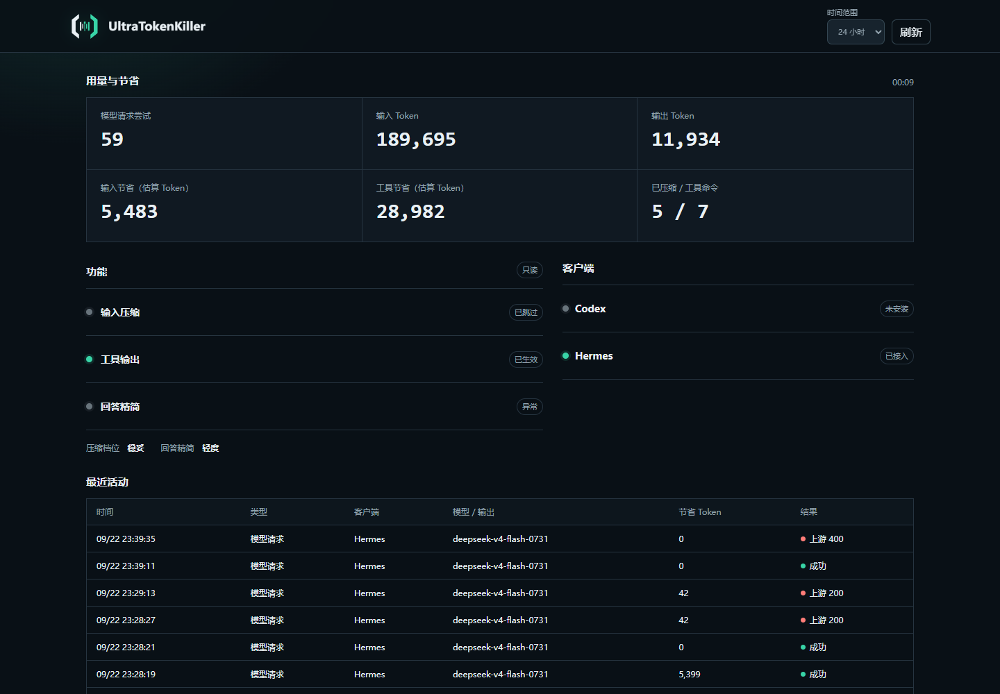

<picture>
  <source media="(prefers-color-scheme: dark)" srcset="web/public/brand/utk-lockup.svg">
  
</picture>

# UltraTokenKiller

UTK 让 AI 编程助手少读重复内容、少浪费 Token。它在本机压缩过长的命令输出和后续请求，也可以让回答稍微简短一些。你的模型、服务商和密钥仍由原客户端管理，UTK 不会替换或转交它们。

## 用途

- 长日志、测试结果和搜索结果会缩成摘要，失败信息、退出码和关键标识会保留。
- 后续请求可以少带重复的工具输出；需要时可在同一会话中找回原文。
- 回答精简支持“关闭”和“轻度”。更强的档位属于实验功能，不建议日常使用。
- 无法安全处理的内容会原样通过，不会为了压缩而硬改。

## 安装

需要 Python 3.10 或更高版本，推荐 Python 3.11。

Windows：

```powershell
powershell -ExecutionPolicy Bypass -File .\scripts\install.ps1
```

macOS / Linux：

```sh
sh ./scripts/install.sh
```

安装或升级后检查一次：

```sh
utk doctor
```

重复执行安装和接入命令是安全的，不会删除其他插件或用户设置。

## 接入

Codex：

```sh
utk codex
```

Hermes Agent：

```sh
utk enable hermes
```

接入后重启 Hermes。UTK 会保留 Hermes 原来的模型、服务商和凭据，只安装自己的插件并把模型请求交给本机代理。

只想压缩一条命令时：

```sh
utk exec -- python -m pytest -v
```

开启轻度回答精简：

```sh
utk profile safe --caveman lite
```

## 查看效果

```sh
utk web
```

先执行一次真实任务，再看页面：

- “已生效”表示最近的请求确实使用了该功能。
- “已跳过”表示这次没有适合处理的内容。
- “异常”表示这次处理或上游请求失败，可在活动详情中看脱敏后的原因。
- Token 节省量是估算值，实际费用以模型服务商账单为准。

公网页面只读，不会显示密钥、正文、会话标识、恢复句柄或本地配置路径。模型代理只监听本机。



## 停用

取消 Hermes 接入：

```sh
utk disable hermes
```

关闭输入压缩和回答精简：

```sh
utk profile off --caveman off
```

停止 UTK 服务：

```sh
utk stop
```

停用只撤销 UTK 管理的配置，不会改动原来的模型、服务商、凭据或其他插件。

## 故障处理

先运行：

```sh
utk doctor
utk status
```

- 看不到记录：确认客户端已经接入并重启，再执行一次真实任务。
- 无法找回原文：原文只在当前会话的内存中临时保存；会话过期或服务重启后无法恢复。
- Hermes 插件找不到 `utk`：重新运行安装脚本，再执行 `utk enable hermes`。
- 页面显示“异常”：查看最近活动中的状态码和错误类别；不要连续重试模型请求。
- 需要恢复：先执行 `utk disable hermes`，再恢复接入前备份的 Hermes 配置。
